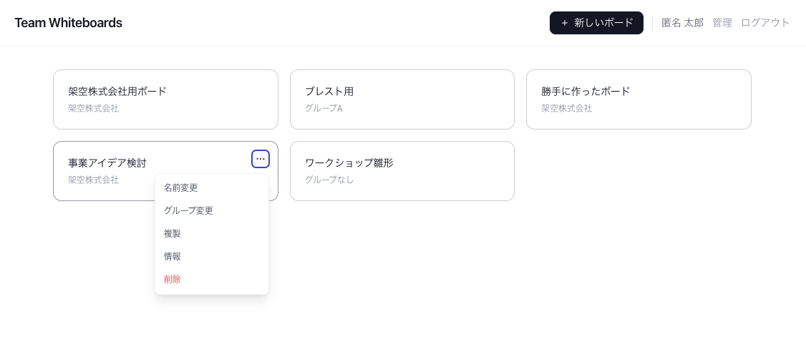
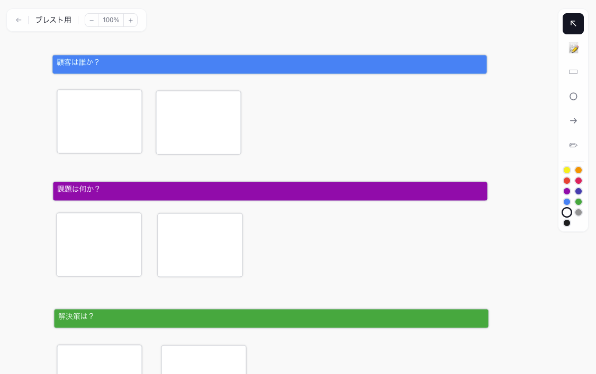

# Team Whiteboards

複数ユーザーがリアルタイムで共同編集できる簡易的なホワイトボードアプリケーションです。

AWS CDKでAWS環境にサーバーレス構成でデプロイ可能です。  
ユーザーはCognitoで認証され、WebSocketを介してボードの状態がリアルタイムに同期されます。  

 - グループを自由に作成して、グループ単位でホワイトボードを共有できます。
 - 管理者ユーザーは全てのボードにアクセスでき、グループ管理が可能です。
 - 一般ユーザーは自分が所属するグループのボードにのみアクセスできます。

## 画面イメージ

### トップ画面(ボード一覧)


### ボード画面(リアルタイムの共同編集が可能)



## 機能

- 付箋・矩形・円・矢印・フリーハンド描画
- WebSocket によるリアルタイム同期
- 他ユーザーのカーソル表示
- ズーム（Ctrl+ホイール）・パン（ホイール / 空白ドラッグ）
- Undo / Redo（Ctrl+Z / Ctrl+Shift+Z）
- コピー＆ペースト（Ctrl+C / Ctrl+V）
- 要素の色・フォントサイズ・テキスト色変更
- 最前面 / 最背面への移動
- グループ単位のワークスペース共有
- Amazon Cognito 認証（管理者 / 一般ユーザー）

## アーキテクチャ

```
Browser
  ├─ HTTPS  → CloudFront → S3 (React SPA)
  ├─ /api/* → CloudFront → API Gateway HTTP API → Lambda (REST)
  └─ /ws    → CloudFront → API Gateway WebSocket API → Lambda (WS)
                                    │
                              DynamoDB (6テーブル)
                                    │
                           Cognito User Pool (JWT)
```

## 技術スタック

| 領域 | 技術 |
|------|------|
| Frontend | React 18 + Vite + TypeScript |
| キャンバス | react-konva |
| UI | Tailwind CSS + shadcn/ui |
| 状態管理 | Zustand |
| Backend | AWS Lambda (Node.js 22.x) |
| WebSocket | API Gateway WebSocket API |
| REST API | API Gateway HTTP API |
| 認証 | Amazon Cognito |
| DB | Amazon DynamoDB |
| インフラ | AWS CDK v2 |
| AWSリージョン | us-east-1 |

## プロジェクト構造

```
team-whiteboards/
├── packages/
│   ├── shared/       # 共有型定義 (@whiteboard/shared)
│   ├── frontend/     # React SPA
│   └── functions/    # Lambda ハンドラー群
│       └── src/
│           ├── lib/            # DynamoDB / API GW / 認証 共通処理
│           ├── api-rest.ts     # REST API Lambda
│           ├── ws-connect.ts   # WebSocket $connect
│           ├── ws-disconnect.ts
│           └── ws-message.ts
├── docker/
│   └── docker-compose.serverless.yml  # DynamoDB Local (開発用)
├── infra/            # AWS CDK v2 スタック
├── scripts/
│   └── create-tables-local.ts         # ローカルテーブル作成スクリプト
└── package.json      # npm workspaces
```

## Make コマンド

Makefile にセットアップ・ビルド・開発サーバー起動・デプロイの各コマンドを定義しています。

```bash
make help       # 使用可能なコマンド一覧を表示
```

| コマンド | 説明 |
|---------|------|
| `make install` | 依存パッケージをインストール |
| `make build` | 全パッケージをビルド（shared → frontend + functions） |
| `make build-shared` | shared パッケージのみビルド |
| `make build-frontend` | フロントエンドをビルド |
| `make build-functions` | Lambda 関数をビルド |
| `make typecheck` | 全パッケージの型チェック |
| `make dev` | ローカル開発環境を一括起動 |
| `make dev-dynamo` | DynamoDB Local を起動（Docker, :8000） |
| `make dev-tables` | DynamoDB Local にテーブルを作成 |
| `make dev-backend` | バックエンド開発サーバーを起動（:8080） |
| `make dev-frontend` | フロントエンド開発サーバーを起動（:5173） |
| `make deploy` | CDK デプロイ（dev 環境） |
| `make deploy-prod` | CDK デプロイ（prod 環境） |
| `make clean` | ビルド成果物を削除 |

## ローカル開発

### 前提条件

- Node.js 22+
- Docker（Rancher Desktop / Docker Desktop）

### 1. セットアップ

```bash
make install
```

### 2. 環境変数設定

```bash
cp packages/frontend/.env.example packages/frontend/.env
```

`packages/frontend/.env`:
```env
VITE_AUTH_MODE=local   # Cognito を使わずローカルトークンで認証
```

> **Note**: 本番環境の Cognito 設定（UserPoolId / ClientId）は CDK が `/config.json` として S3 に自動デプロイするため、`VITE_COGNITO_*` 環境変数は不要です。

### 3. DynamoDB Local 起動（初回・Docker 再起動後）

```bash
make dev-dynamo   # DynamoDB Local コンテナ起動（port 8000）
make dev-tables   # テーブル作成
```

> `-inMemory` モードのため Docker を再起動するとデータが消えます。
> 再起動後は `make dev-tables` を再実行してください。

### 4. バックエンド起動

```bash
make dev-backend
# → http://localhost:8080 で起動
```

### 5. フロントエンド起動

```bash
make dev-frontend
# → http://localhost:5173
```

### ローカルログイン

`VITE_AUTH_MODE=local` の場合、ログイン画面で任意の表示名を入力してログインできます（パスワード不要）。管理者フラグも画面から切り替え可能です。

---

## AWS デプロイ

### 前提条件

- AWS CLI 設定済み（`aws configure`）
- CDK ブートストラップ済み（`npx cdk bootstrap --region us-east-1`）

### 1. ビルド

```bash
make build
```

### 2. CDK デプロイ

`-c env=<環境名>` で環境を指定します（デフォルト: `dev`）。同一 AWS アカウントに複数環境をデプロイ可能です。

```bash
# dev 環境
make deploy

# prod 環境
make deploy-prod
```

デプロイ順序: `Whiteboard-{Env}-Auth` → `Whiteboard-{Env}-Data` → `Whiteboard-{Env}-Api` → `Whiteboard-{Env}-Frontend`

環境ごとに以下のリソースが分離されます:
- DynamoDB テーブル: `wb-{env}-connections`, `wb-{env}-boards` 等
- Cognito UserPool: `whiteboard-{env}-users`
- Secrets Manager: `whiteboard/{env}/cloudfront-secret`

> **CloudFront シークレット**: CloudFront → API Gateway 間のオリジン検証シークレットは、初回デプロイ時に AWS Secrets Manager で自動生成・永続化されます。手動設定は不要です。

出力例（dev 環境）:
```
Whiteboard-Dev-Auth.UserPoolId         = us-east-1_XXXXXXXXX
Whiteboard-Dev-Auth.UserPoolClientId   = XXXXXXXXXXXXXXXXXXXXXXXXXX
Whiteboard-Dev-Api.HttpApiEndpoint     = https://xxxxxxxxxx.execute-api.us-east-1.amazonaws.com
Whiteboard-Dev-Api.WsApiEndpoint       = wss://xxxxxxxxxx.execute-api.us-east-1.amazonaws.com/ws
Whiteboard-Dev-Frontend.CloudFrontUrl  = https://xxxxxxxxxxxx.cloudfront.net
```

### Cognito 設定の自動注入

フロントエンドの Cognito 設定（UserPoolId / ClientId）は CDK デプロイ時に `/config.json` として S3 に自動配置されます。`VITE_COGNITO_*` 環境変数の手動設定は不要です。

フロントエンドはランタイムで `/config.json` を読み込むため、Cognito の値が変わっても **フロントエンドの再ビルドは不要** です。

---

## 管理者設定

Cognito の `Admins` グループに追加されたユーザーは全ボードへのアクセスとグループ管理が可能です。

```bash
aws cognito-idp admin-add-user-to-group \
  --user-pool-id <UserPoolId> \
  --username <email> \
  --group-name Admins \
  --region us-east-1
```

---

## WebSocket プロトコル

接続: `wss://<host>/ws?boardId=<id>&token=<JWT>`

| 方向 | type | 説明 |
|------|------|------|
| S→C | `init` | 全要素 + オンラインユーザー一覧 |
| S→C | `element_add/update/delete` | 要素変更のブロードキャスト |
| S→C | `cursor_move` | 他ユーザーのカーソル位置 |
| S→C | `user_joined/left` | 入退室通知 |
| C→S | `request_init` | 接続確立直後に送信し `init` を要求 |
| C→S | `element_add/update/delete` | 要素操作 |
| C→S | `cursor_move` | カーソル位置（500ms スロットル） |
| C→S | `ping` | keepalive（25s 間隔） |

---

## キーボードショートカット

| ショートカット | 操作 |
|--------------|------|
| Ctrl+Z | Undo |
| Ctrl+Shift+Z | Redo |
| Ctrl+C | 選択要素をコピー |
| Ctrl+V | ペースト（+20px ずつオフセット） |
| Delete / Backspace | 選択要素を削除 |
| Ctrl+ホイール | ズーム |
| Shift+ホイール | 水平スクロール |
| Escape | 選択解除 / 編集キャンセル |
